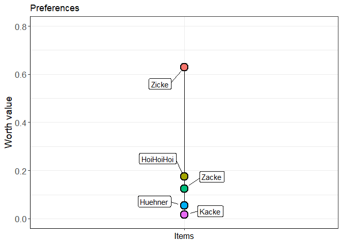

<!-- README.md is generated from README.Rmd. Please edit that file -->

# simsalRbim 

# simsalRbim - A package for preference test simulations

<!-- badges: start -->

[](https://travis-ci.org/r-lib/usethis)
<!-- badges: end -->

Preference tests are a valuable tool to measure the “wants” of
individuals and have been proven to be a valid method to rate different
commodities. The number of commodities presented at the same time is,
however, limited and in classical test settings usually, only two
options are presented. In our paper, we evaluate the option of combining
multiple binary choices to rank preferences among a larger number of
commodities. The **simsalRbim** package offers the necessary tools to
test selections of commodities and to obtain an estimate of new or
incompletely tested items and their relative position.

[simsalRbim Website](https://talbotsr.com/simsalRbim/index.html)

## Data availability

Besides the internal ZickeZacke data, we provide additional experimental
data from six different preference tests. These data can be downloaded
from a separate [GitHub](https://github.com/mytalbot/simsalRbim_data)
repository and can be used directly in this package (e.g., with the
bimload function).

## Dependencies

**simsalRbim** was developed on R (v4.0.3). It depends on the following
packages (in no particular order, excluding R base packages) and may
have to be installed manually.

dplyr  
ggplot2  
gnm  
prefmod  
reshape2  
rlang  
stringr  
viridis  
ggrepel

The following function can be used to install single packages - or just
the missing ones from CRAN.

``` {r
install.packages("paste missing package name here")
```

### Installation

The development version of the simsalRbim package can be downloaded from
GitHub with the following command.

``` {r
# install.packages("devtools")
devtools::install_github("mytalbot/simsalRbim")
library(simsalRbim)
```

## Example

This example uses the internal data (ZickeZacke) to perform a simple
randomization on the positioning of the incomplete ‘HoiHoiHoi’ item.

``` r
library(simsalRbim)

dat        <- ZickeZacke

simOpt     <- "HoiHoiHoi"
GT         <- c("Zacke", "Huehner", "Kacke",  "Zicke" )

predat     <- bimpre(dat=dat, GT=GT, simOpt=simOpt)
#> simsalRbim: 1 tie(s) marked.

worth      <- bimworth(ydata    = predat,
                       GT       = GT,
                       simOpt   = simOpt,
                       showPlot = "worth")
```


